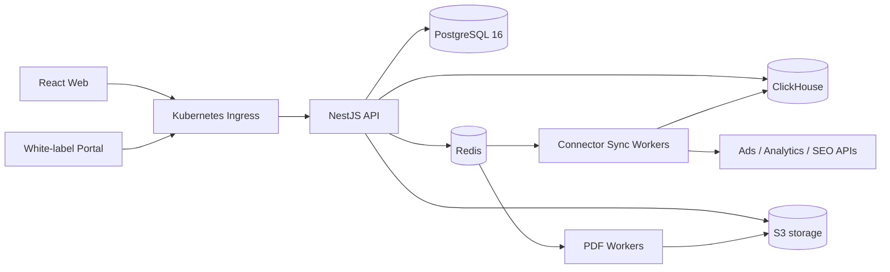
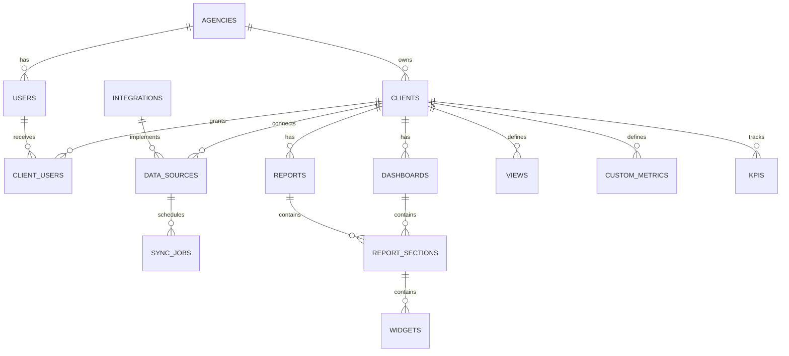

# IMDS Marketing Analytics Architecture

## Runtime topology

## Core entity model

## Tenant isolation

- Every mutable business table contains `agency_id`.
- JWT authentication resolves an external auth subject.
- `x-agency-id` is accepted only after `analytics.is_agency_member` validates membership.
- Each transaction executes `set_config('app.agency_id', agencyId, true)` before queries.
- PostgreSQL RLS policies reject rows outside the active tenant.
- ClickHouse queries always bind `agency_id` as a typed parameter; raw string interpolation is prohibited.

## Data path

1. A data source creates a BullMQ synchronization job.
2. A connector fetches paginated provider data with provider-specific backoff.
3. Rows are normalized to canonical metrics.
4. Idempotent inserts use `ReplacingMergeTree(version)`.
5. API queries aggregate current and comparison periods from ClickHouse.
6. Redis caches widget results and invalidates keys after successful sync events.

## Repository migration

- `apps/web`: retained and migrated to the new API.
- `apps/api`: new primary backend.
- `apps/sync-worker`: connector ETL worker.
- `apps/worker`: legacy Cloudflare backend; removal after cutover.
- `infra/postgres`: metadata migrations.
- `infra/clickhouse`: fact schema and materialized views.
- `infra/k8s`: production manifests.
